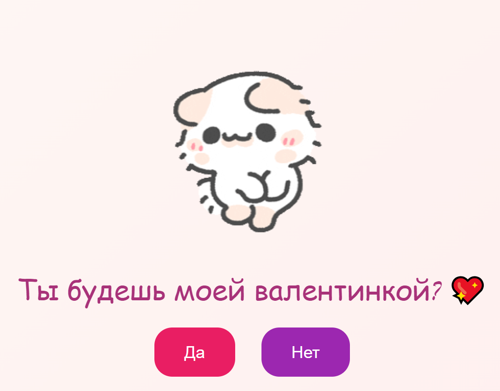

# 💖 Valentine's Day Card

Это цифровая валентинка, созданная с помощью HTML, CSS и JavaScript. Она содержит анимированное изображение сердца, милую надпись и интерактивные кнопки "Да" и "Нет". При наведении на кнопку "Нет" она будет случайным образом перемещаться по экрану.

---

## 🚀 Как использовать

1. Скопируйте код из файла `index.html`.
2. Создайте новый репозиторий на GitHub и загрузите файл.
3. Откройте `index.html` в браузере, чтобы увидеть валентинку.

---

## 🎨 Функциональные возможности

- Анимированное изображение сердца.
- Милая надпись "Ты будешь моей валентинкой?".
- Интерактивные кнопки "Да" и "Нет".
- Кнопка "Нет" перемещается по экрану при наведении.
- Анимация текста и изображения.
- Адаптивный дизайн для всех устройств.

---

## 🖼️ Демонстрация

{: width="70%" }

---

## 📋 Требования

- Веб-браузер (Chrome, Firefox, Safari и т.д.).

---

## 🛠️ Технологии

- HTML
- CSS
- JavaScript

---

## 📝 Лицензия

Этот проект открыт для использования и модификации. Не забудьте указать автора, если используете код в своих проектах.

---

Создано с ❤️ для вашего вдохновения!